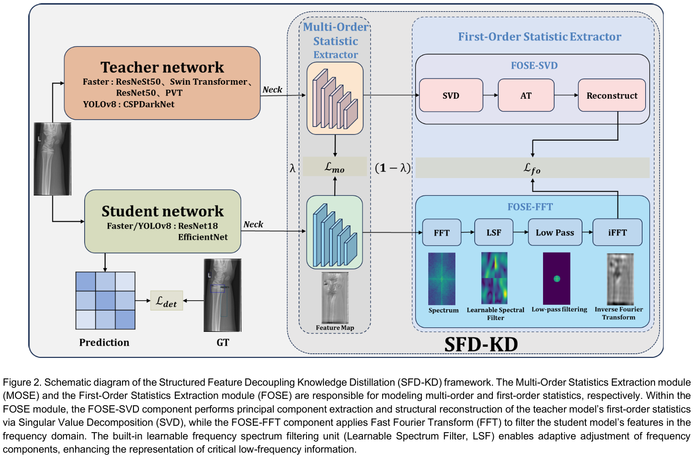

# **SFD-KD：Structured Feature Decoupling Knowledge Distillation for Fracture Detection**

A pytorch implenment for SFD-KD：Structured Feature Decoupling Knowledge Distillation for Fracture Detection

# Overview of our SFD-KD




# Directory

- [Requirement](#requirement)
  - [MMCV](#mmcv)
  - [Other required package](#other-required-package)
- [Datasets](#datasets)
  - [GRAZPEDWRI-DX](#synapse)
  - [FracAtlas](#flare22)
- [Training and testing](#training-and-testing)
- [Results](#results)
    - [[GRAZPEDWRI-DX]](#results-on-GRAZPEDWRI-DX)
    - [[FracAtlas]](#results-on-FracAtlas)
- [Acknowledgement](#acknowledgement)
- [Citation](#citation)
- [License](#license)

# Requirement
- Pytorch >= 1.12.0
- MMCV
## MMCV
This repo is required the MMCV, it can be simply install by:

```pycon
pip install -U openmim
mim install mmcv
```

## Other required package
We have a lot of required package listed in [here](requirements.txt).

You can simply run the following script to install the required package:

```pycon
pip install -r requirements.txt
```

# Datasets

## GRAZPEDWRI-DX

You counld get GRAZPEDWRI-DX data from [here](https://www.synapse.org/#!Synapse:syn3193805/wiki/217752 "https://www.synapse.org/#!Synapse:syn3193805/wiki/217752").

## FracAtlas
You counld get FracAtlas raw data from [here](https://flare22.grand-challenge.org).

# Training and testing

-   Training on one GPU:

```python
python train.py 
```

-   Testing on one GPU:

```python
python test.py
```
# Results

## Results on GRAZPEDWRI-DX

<table style="text-align: center; margin: auto;">
  <tr>
    <th rowspan="2" style="text-align: center;">Methods</th>
    <th colspan="3" style="text-align: center;">T1: ResNeSt50</th>
    <th colspan="3" style="text-align: center;">T2: Swin Transformer</th>
  </tr>
  <tr>
    <th style="text-align: center;">mAP@0.5:0.95</th>
    <th style="text-align: center;">mAP@0.5</th>
    <th style="text-align: center;">mAP@0.75</th>
    <th style="text-align: center;">mAP@0.5:0.95</th>
    <th style="text-align: center;">mAP@0.5</th>
    <th style="text-align: center;">mAP@0.75</th>
  </tr>
  <tr>
    <td style="text-align: center;">Teacher</td>
    <td style="text-align: center;">30.8</td>
    <td style="text-align: center;">56.8</td>
    <td style="text-align: center;">30.5</td>
    <td style="text-align: center;">30.4</td>
    <td style="text-align: center;">56.6</td>
    <td style="text-align: center;">29.5</td>
  </tr>
  <tr>
    <td style="text-align: center;">S1: ResNet18</td>
    <td style="text-align: center;">21.4</td>
    <td style="text-align: center;">41</td>
    <td style="text-align: center;">19.6</td>
    <td style="text-align: center;">21.4</td>
    <td style="text-align: center;">41</td>
    <td style="text-align: center;">19.6</td>
  </tr>
  <tr>
    <td style="text-align: center;">KD</td>
    <td style="text-align: center;">23.5</td>
    <td style="text-align: center;">42.7</td>
    <td style="text-align: center;">21.1</td>
    <td style="text-align: center;">23.8</td>
    <td style="text-align: center;">42.4</td>
    <td style="text-align: center;">21.7</td>
  </tr>
  <tr>
    <td style="text-align: center;">DKD</td>
    <td style="text-align: center;">23.9</td>
    <td style="text-align: center;">43.6</td>
    <td style="text-align: center;">21.7</td>
    <td style="text-align: center;">24.2</td>
    <td style="text-align: center;">44.5</td>
    <td style="text-align: center;">21.9</td>
  </tr>
  <tr>
    <td style="text-align: center;">RKD</td>
    <td style="text-align: center;">23.9</td>
    <td style="text-align: center;">45.2</td>
    <td style="text-align: center;">22</td>
    <td style="text-align: center;">25.1</td>
    <td style="text-align: center;">46.6</td>
    <td style="text-align: center;">23.2</td>
  </tr>
  <tr>
    <td style="text-align: center;">CWD</td>
    <td style="text-align: center;">24.2</td>
    <td style="text-align: center;">47.6</td>
    <td style="text-align: center;">22.4</td>
    <td style="text-align: center;">24.6</td>
    <td style="text-align: center;">47.1</td>
    <td style="text-align: center;">22.6</td>
  </tr>
  <tr>
    <td style="text-align: center;">MasKD</td>
    <td style="text-align: center;">24.4</td>
    <td style="text-align: center;">47.1</td>
    <td style="text-align: center;">21.9</td>
    <td style="text-align: center;">25.2</td>
    <td style="text-align: center;">47.4</td>
    <td style="text-align: center;">23.2</td>
  </tr>
  <tr>
    <td style="text-align: center;">FreeKD</td>
    <td style="text-align: center;">25.7</td>
    <td style="text-align: center;">48.7</td>
    <td style="text-align: center;">23.8</td>
    <td style="text-align: center;">25.2</td>
    <td style="text-align: center;">46.9</td>
    <td style="text-align: center;">23.5</td>
  </tr>
  <tr>
    <td style="text-align: center;">Ours</td>
    <td style="text-align: center;">26.2</td>
    <td style="text-align: center;">50.4</td>
    <td style="text-align: center;">24</td>
    <td style="text-align: center;">25</td>
    <td style="text-align: center;">48.4</td>
    <td style="text-align: center;">22.8</td>
  </tr>
  <tr>
    <td style="text-align: center;">S2: EfficientNet-es</td>
    <td style="text-align: center;">21.6</td>
    <td style="text-align: center;">43</td>
    <td style="text-align: center;">18.9</td>
    <td style="text-align: center;">21.6</td>
    <td style="text-align: center;">43</td>
    <td style="text-align: center;">18.9</td>
  </tr>
  <tr>
    <td style="text-align: center;">KD</td>
    <td style="text-align: center;">23.6</td>
    <td style="text-align: center;">45.3</td>
    <td style="text-align: center;">21.5</td>
    <td style="text-align: center;">23.7</td>
    <td style="text-align: center;">44.4</td>
    <td style="text-align: center;">22.5</td>
  </tr>
  <tr>
    <td style="text-align: center;">DKD</td>
    <td style="text-align: center;">24.5</td>
    <td style="text-align: center;">46.2</td>
    <td style="text-align: center;">22.3</td>
    <td style="text-align: center;">24.2</td>
    <td style="text-align: center;">45.3</td>
    <td style="text-align: center;">22.7</td>
  </tr>
  <tr>
    <td style="text-align: center;">RKD</td>
    <td style="text-align: center;">25.1</td>
    <td style="text-align: center;">46.9</td>
    <td style="text-align: center;">23.6</td>
    <td style="text-align: center;">25.1</td>
    <td style="text-align: center;">46.6</td>
    <td style="text-align: center;">23.8</td>
  </tr>
  <tr>
    <td style="text-align: center;">CWD</td>
    <td style="text-align: center;">24.8</td>
    <td style="text-align: center;">48.5</td>
    <td style="text-align: center;">22.6</td>
    <td style="text-align: center;">24.6</td>
    <td style="text-align: center;">45.8</td>
    <td style="text-align: center;">23</td>
  </tr>
  <tr>
    <td style="text-align: center;">MasKD</td>
    <td style="text-align: center;">25</td>
    <td style="text-align: center;">47.3</td>
    <td style="text-align: center;">23.2</td>
    <td style="text-align: center;">22.8</td>
    <td style="text-align: center;">44</td>
    <td style="text-align: center;">21.2</td>
  </tr>
  <tr>
    <td style="text-align: center;">FreeKD</td>
    <td style="text-align: center;">25.6</td>
    <td style="text-align: center;">48.6</td>
    <td style="text-align: center;">23.5</td>
    <td style="text-align: center;">24.5</td>
    <td style="text-align: center;">46.6</td>
    <td style="text-align: center;">22.8</td>
  </tr>
  <tr>
    <td style="text-align: center;">Ours</td>
    <td style="text-align: center;">26.1</td>
    <td style="text-align: center;">48.9</td>
    <td style="text-align: center;">24</td>
    <td style="text-align: center;">25.6</td>
    <td style="text-align: center;">48.2</td>
    <td style="text-align: center;">23.6</td>
  </tr>
</table>

<table style="border-collapse: collapse; width: 100%; text-align: center; margin: auto;">
  <tr>
    <th rowspan="3">Methods</th>
    <th colspan="6">T1: CSPDarkNet</th>
  </tr>
  <tr>
    <th colspan="3">S1: ResNet18</th>
    <th colspan="3">S2: EfficientNet-es</th>
  </tr>
  <tr>
    <th>mAP@0.5:0.95</th>
    <th>mAP@0.5</th>
    <th>mAP@0.75</th>
    <th>mAP@0.5:0.95</th>
    <th>mAP@0.5</th>
    <th>mAP@0.75</th>
  </tr>
  <tr>
    <td>Teacher</td>
    <td>38.5</td>
    <td>62.4</td>
    <td>41.1</td>
    <td>38.5</td>
    <td>62.4</td>
    <td>41.1</td>
  </tr>
  <tr>
    <td>Student</td>
    <td>32</td>
    <td>55.2</td>
    <td>33</td>
    <td>31.8</td>
    <td>54</td>
    <td>32.6</td>
  </tr>
  <tr>
    <td>KD</td>
    <td>32.7</td>
    <td>56</td>
    <td>33.6</td>
    <td>32.1</td>
    <td>54.3</td>
    <td>33.1</td>
  </tr>
  <tr>
    <td>DKD</td>
    <td>32.3</td>
    <td>56.4</td>
    <td>34</td>
    <td>32</td>
    <td>55.2</td>
    <td>32.8</td>
  </tr>
  <tr>
    <td>RKD</td>
    <td>35.1</td>
    <td>58.8</td>
    <td>36.2</td>
    <td>32.4</td>
    <td>56.9</td>
    <td>33.2</td>
  </tr>
  <tr>
    <td>CWD</td>
    <td>33.8</td>
    <td>59.4</td>
    <td>33.5</td>
    <td>33.6</td>
    <td>57.7</td>
    <td>34.3</td>
  </tr>
  <tr>
    <td>MasKD</td>
    <td>35.3</td>
    <td>60.3</td>
    <td>33.9</td>
    <td>34.2</td>
    <td>59.1</td>
    <td>34</td>
  </tr>
  <tr>
    <td>FreeKD</td>
    <td>35.1</td>
    <td>60.8</td>
    <td>36</td>
    <td>34.1</td>
    <td>58.1</td>
    <td>35.7</td>
  </tr>
  <tr style="background-color: #f2f2f2;">
    <td>Ours</td>
    <td>37.1</td>
    <td>61</td>
    <td>37.8</td>
    <td>35.2</td>
    <td>58.5</td>
    <td>37.1</td>
  </tr>
</table>


## Results on FracAtlas

<table style="border-collapse: collapse; width: 100%; text-align: center; margin: auto;">
  <tr>
    <th rowspan="2">Methods</th>
    <th colspan="3">T1: ResNet50</th>
    <th colspan="3">T2: PVT</th>
  </tr>
  <tr>
    <th>mAP@0.5:0.95</th>
    <th>mAP@0.5</th>
    <th>mAP@0.75</th>
    <th>mAP@0.5:0.95</th>
    <th>mAP@0.5</th>
    <th>mAP@0.75</th>
  </tr>
  <tr>
    <td>Teacher</td>
    <td>17.9</td>
    <td>48.4</td>
    <td>12.9</td>
    <td>20.7</td>
    <td>54.3</td>
    <td>14.2</td>
  </tr>
  <tr>
    <td>S1: ResNet18</td>
    <td>11.3</td>
    <td>32.3</td>
    <td>3.3</td>
    <td>11.3</td>
    <td>32.3</td>
    <td>3.3</td>
  </tr>
  <tr>
    <td>KD</td>
    <td>11.8</td>
    <td>35.2</td>
    <td>3.6</td>
    <td>11.5</td>
    <td>33.7</td>
    <td>3.6</td>
  </tr>
  <tr>
    <td>DKD</td>
    <td>12.2</td>
    <td>36.8</td>
    <td>3.9</td>
    <td>12.6</td>
    <td>35.4</td>
    <td>4</td>
  </tr>
  <tr>
    <td>RKD</td>
    <td>13.2</td>
    <td>39.2</td>
    <td>6.1</td>
    <td>13.6</td>
    <td>39.6</td>
    <td>5</td>
  </tr>
  <tr>
    <td>CWD</td>
    <td>13.7</td>
    <td>40.4</td>
    <td>5.1</td>
    <td>12.9</td>
    <td>41.6</td>
    <td>4.8</td>
  </tr>
  <tr>
    <td>MasKD</td>
    <td>13.3</td>
    <td>42.5</td>
    <td>5.5</td>
    <td>13.1</td>
    <td>41.5</td>
    <td>3.3</td>
  </tr>
  <tr>
    <td>FreeKD</td>
    <td>12.3</td>
    <td>38.9</td>
    <td>5.2</td>
    <td>12</td>
    <td>37.4</td>
    <td>4.6</td>
  </tr>
  <tr style="background-color: #f2f2f2;">
    <td>Ours</td>
    <td>14.7</td>
    <td>43.2</td>
    <td>7.5</td>
    <td>14.6</td>
    <td>43.6</td>
    <td>4.6</td>
  </tr>
  <tr>
    <td>S2: EfficientNet-es</td>
    <td>9.7</td>
    <td>30.3</td>
    <td>3.3</td>
    <td>9.7</td>
    <td>30.3</td>
    <td>3.3</td>
  </tr>
  <tr>
    <td>KD</td>
    <td>10.4</td>
    <td>32.8</td>
    <td>3.9</td>
    <td>10.1</td>
    <td>32.4</td>
    <td>3.7</td>
  </tr>
  <tr>
    <td>DKD</td>
    <td>10.9</td>
    <td>33.2</td>
    <td>4.2</td>
    <td>10.5</td>
    <td>33.6</td>
    <td>3.9</td>
  </tr>
  <tr>
    <td>RKD</td>
    <td>12.2</td>
    <td>35.6</td>
    <td>5.9</td>
    <td>12.4</td>
    <td>36</td>
    <td>5.9</td>
  </tr>
  <tr>
    <td>CWD</td>
    <td>12.3</td>
    <td>36</td>
    <td>5.1</td>
    <td>13.1</td>
    <td>37.6</td>
    <td>5.7</td>
  </tr>
  <tr>
    <td>MasKD</td>
    <td>11.9</td>
    <td>36.1</td>
    <td>6.3</td>
    <td>12.5</td>
    <td>37.2</td>
    <td>4.9</td>
  </tr>
  <tr>
    <td>FreeKD</td>
    <td>11.6</td>
    <td>34.2</td>
    <td>5.3</td>
    <td>12.1</td>
    <td>36.7</td>
    <td>5.4</td>
  </tr>
  <tr style="background-color: #f2f2f2;">
    <td>Ours</td>
    <td>13</td>
    <td>37.5</td>
    <td>5.8</td>
    <td>13.5</td>
    <td>38.5</td>
    <td>6.3</td>
  </tr>
</table>

<table style="border-collapse: collapse; width: 100%; text-align: center; margin: auto;">
  <tr>
    <th rowspan="3">Methods</th>
    <th colspan="6">T1: CSPDarkNet</th>
  </tr>
  <tr>
    <th colspan="3">S1: ResNet18</th>
    <th colspan="3">S2: EfficientNet-es</th>
  </tr>
  <tr>
    <th>mAP@0.5:0.95</th>
    <th>mAP@0.5</th>
    <th>mAP@0.75</th>
    <th>mAP@0.5:0.95</th>
    <th>mAP@0.5</th>
    <th>mAP@0.75</th>
  </tr>
  <tr>
    <td>Teacher</td>
    <td>22</td>
    <td>54.2</td>
    <td>13.7</td>
    <td>22</td>
    <td>54.2</td>
    <td>13.7</td>
  </tr>
  <tr>
    <td>Student</td>
    <td>14.1</td>
    <td>38.4</td>
    <td>6.3</td>
    <td>13.3</td>
    <td>38.6</td>
    <td>4.4</td>
  </tr>
  <tr>
    <td>KD</td>
    <td>14.8</td>
    <td>40.3</td>
    <td>6.8</td>
    <td>15.2</td>
    <td>40.1</td>
    <td>5.4</td>
  </tr>
  <tr>
    <td>DKD</td>
    <td>15.2</td>
    <td>41.5</td>
    <td>6.6</td>
    <td>15.6</td>
    <td>42.2</td>
    <td>6.2</td>
  </tr>
  <tr>
    <td>RKD</td>
    <td>16.8</td>
    <td>43.7</td>
    <td>9.2</td>
    <td>17</td>
    <td>43.5</td>
    <td>5.7</td>
  </tr>
  <tr>
    <td>CWD</td>
    <td>17.2</td>
    <td>44.8</td>
    <td>8.4</td>
    <td>17.3</td>
    <td>45.3</td>
    <td>8.3</td>
  </tr>
  <tr>
    <td>MasKD</td>
    <td>17.2</td>
    <td>44.1</td>
    <td>8.5</td>
    <td>15.9</td>
    <td>42.8</td>
    <td>9.6</td>
  </tr>
  <tr>
    <td>FreeKD</td>
    <td>16.4</td>
    <td>44.3</td>
    <td>6.7</td>
    <td>17.8</td>
    <td>45.9</td>
    <td>6.3</td>
  </tr>
  <tr style="background-color: #f2f2f2;">
    <td>Ours</td>
    <td>18.5</td>
    <td>45.4</td>
    <td>8.9</td>
    <td>18.1</td>
    <td>45.6</td>
    <td>10.7</td>
  </tr>
</table>


# Acknowledgement

Specially thanks to the following: 
- [MMDetection ](https://github.com/open-mmlab/mmdetection "mmdetection ")

- [MMRazor](https://github.com/open-mmlab/mmrazor "MMRazor")

- [MMEngine](https://github.com/open-mmlab/mmengine "MMEngine")

  

# Citation

```bash
@article{mmdetection,
  title   = {{MMDetection}: Open MMLab Detection Toolbox and Benchmark},
  author  = {Chen, Kai and Wang, Jiaqi and Pang, Jiangmiao and Cao, Yuhang and
             Xiong, Yu and Li, Xiaoxiao and Sun, Shuyang and Feng, Wansen and
             Liu, Ziwei and Xu, Jiarui and Zhang, Zheng and Cheng, Dazhi and
             Zhu, Chenchen and Cheng, Tianheng and Zhao, Qijie and Li, Buyu and
             Lu, Xin and Zhu, Rui and Wu, Yue and Dai, Jifeng and Wang, Jingdong
             and Shi, Jianping and Ouyang, Wanli and Loy, Chen Change and Lin, Dahua},
  journal= {arXiv preprint arXiv:1906.07155},
  year={2019}
}
@misc{2021mmrazor,
    title={OpenMMLab Model Compression Toolbox and Benchmark},
    author={MMRazor Contributors},
    howpublished = {\url{https://github.com/open-mmlab/mmrazor}},
    year={2021}
}
```

```bash
@misc{2021mmrazor,
    title={OpenMMLab Model Compression Toolbox and Benchmark},
    author={MMRazor Contributors},
    howpublished = {\url{https://github.com/open-mmlab/mmrazor}},
    year={2021}
}
```

```bash
@article{mmengine2022,
  title   = {{MMEngine}: OpenMMLab Foundational Library for Training Deep Learning Models},
  author  = {MMEngine Contributors},
  howpublished = {\url{https://github.com/open-mmlab/mmengine}},
  year={2022}
}
```

# License 
This project is released under the [Apache 2.0 license](https://github.com/open-mmlab/mmdetection/blob/main/LICENSE "Apache 2.0 license") of mmdetection.
